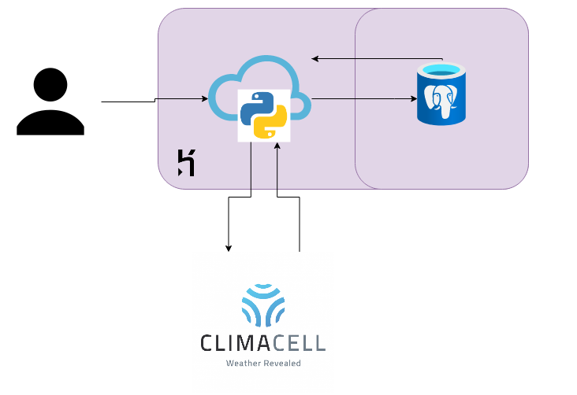

# api-python-weather
Weather API made with Python, Django Rest Framework and ClimaCell API.

### Prerequisites

Python installed;
(optional) Docker installed.

[wip]

## Getting Started

You need to get to the root folder of the project.

From the folder base run the following commands.
`python -m venv env_django`

Linux:
`source activate env_django` 

Windows:
`env\Scripts\activate`

then install the dependencies using 
`pip install requirements.txt`

Other way:
Using docker do a `docker-compose up` in the root folder of the project.

[wip]

### Architecture

### Installing

[wip]

## Running the tests

[wip]

### Break down into end to end tests

[wip]

### And coding style tests

[wip]

## Deployment

You can deploy with Heroku as it is using [Heroku Deployment pipelines](https://devcenter.heroku.com/articles/pipelines)

[wip]

## Built With

* [Heroku](https://www.heroku.com) - is a platform as a service (PaaS) that enables developers to build, run, and operate applications entirely in the cloud.
* [Django Rest Framework](https://www.django-rest-framework.org/) - Django REST framework is a powerful and flexible toolkit for building Web APIs.
* [ClimaCell Weather API](https://www.climacell.co/weather-api/) - The world's best hyperlocal weather API — real-time and historical weather data, customizable for every use case and business model.
* [PostgreSQL](https://www.postgresql.org/) - is a powerful, open source object-relational database system with over 30 years of active development that has earned it a strong reputation for reliability, feature robustness, and performance. 

## Contributing
[wip]

## Versioning

[wip]

## Authors

* **Lucian Lorens** - *Initial work* - [lucianlorens](https://github.com/lucianlorens)

## License

:construction: [wip] :construction:

## Acknowledgments

[wip]
